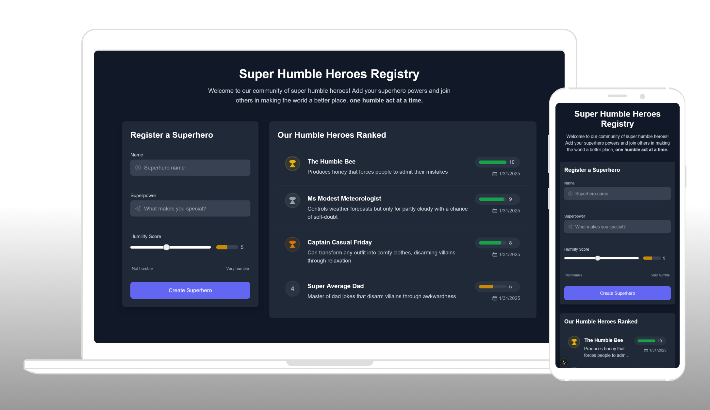

# 🦸‍♂️ Humble Superhero Registry

A modern, real-time web application for registering and showcasing humble superheroes in our community. Built with Next.js, TypeScript, and Tailwind CSS.


## ✨ Features

- 🎯 Real-time updates using WebSocket
- 🎨 Modern, responsive UI with Tailwind CSS
- 🔒 Type-safe development with TypeScript and Zod validation
- ♿ Accessible components following ARIA best practices
- 🚀 Optimized performance with Next.js
- 🔄 Automatic sorting by humility score
- 📱 Fully responsive design
- ✅ Form validation with real-time feedback

## 🛠️ Technical Stack

- **Framework**: Next.js 14 with App Router
- **Language**: TypeScript
- **Styling**: Tailwind CSS
- **State Management**: React Hooks + SWR
- **Real-time**: Socket.io
- **Validation**: Zod
- **Icons**: Heroicons
- **Notifications**: React Hot Toast

## 🚀 Getting Started

### Prerequisites

- Node.js 20.x or later
- npm 9.x or later
- Running instance of the Humble Superhero API

### Installation

1. Clone the repository:

   ```bash
   git clone https://github.com/yourusername/humble-superhero-frontend.git
   cd humble-superhero-frontend
   ```

2. Install dependencies:

   ```bash
   npm install
   ```

3. Create a `.env.local` file:

   ```bash
   cp .env.example .env.local
   ```

   Update the `NEXT_PUBLIC_API_URL` to match your API endpoint.

4. Start the development server:

   ```bash
   npm run dev
   ```

5. Open [http://localhost:3000](http://localhost:3000) in your browser.

## 📸 Mockup



## 📁 Project Structure

```
src/
├── app/                 # Next.js app directory
│   ├── layout.tsx      # Root layout with providers
│   └── page.tsx        # Main page component
├── components/         # React components
│   ├── superhero-form.tsx
│   └── superhero-list.tsx
├── hooks/             # Custom React hooks
│   └── useWebSocket.ts
├── services/          # API services
│   └── api.ts
└── types/             # TypeScript types and validation
    └── superhero.ts
```

## 🔒 Validation Rules

- **Name**:

  - 3-50 characters
  - Letters, numbers, spaces, and hyphens only
  - Required

- **Superpower**:

  - 5-100 characters
  - Required

- **Humility Score**:
  - Integer between 1-10
  - Required
  - Visual indicator with color coding

## 🎨 Design Features

- **Responsive Layout**:

  - Mobile-first approach
  - Adaptive grid system
  - Flexible form and list components

- **Visual Feedback**:

  - Color-coded humility scores
  - Loading states
  - Error states
  - Success notifications
  - Interactive hover states

- **Accessibility**:
  - ARIA labels
  - Keyboard navigation
  - Screen reader support
  - Proper heading hierarchy

## 🔄 Real-time Features

- Instant updates when new heroes are added
- Real-time sorting by humility score
- WebSocket connection management
- Optimistic UI updates
- Fallback to polling when WebSocket fails

## 🧪 Best Practices

- Type-safe development with TypeScript
- Real-time form validation
- Error boundary implementation
- Proper error handling
- Performance optimizations
- SEO best practices
- Responsive design patterns
- Clean code architecture

## 🤝 Collaboration

I would collaborate with a teammate to improve or expand this task by:

- Brainstorming cool styles and animations ideas for the UI
- Adding more interactive elements to the UI
- Checking together possible performance improvements
- Considering changing the color palette to something more modern and colorful. Maybe asking for advice from a designer friend or teammate.

## 🔜 What I would do if I had more time

1. Add comprehensive test coverage

   - Unit tests with Jest
   - Integration tests with React Testing Library
   - E2E tests with Cypress or Playwright

2. Enhanced Features

   - Search and filter functionality
   - Pagination or infinite scroll
   - User authentication
   - Personal superhero profiles
   - Edit and delete capabilities

3. Performance Optimizations

   - Implement client-side caching
   - Add service worker for offline support
   - Code splitting

4. UI/UX Improvements
   - Add more animations
   - Enhanced mobile experience
   - More interactive elements
   - Customizable themes

## 🤝 Contributing

1. Fork the repository
2. Create your feature branch (`git checkout -b feature/amazing-feature`)
3. Commit your changes (`git commit -m 'Add some amazing feature'`)
4. Push to the branch (`git push origin feature/amazing-feature`)
5. Open a Pull Request

## 👏 Acknowledgments

- Built as part of a technical assessment for Ejam job application
